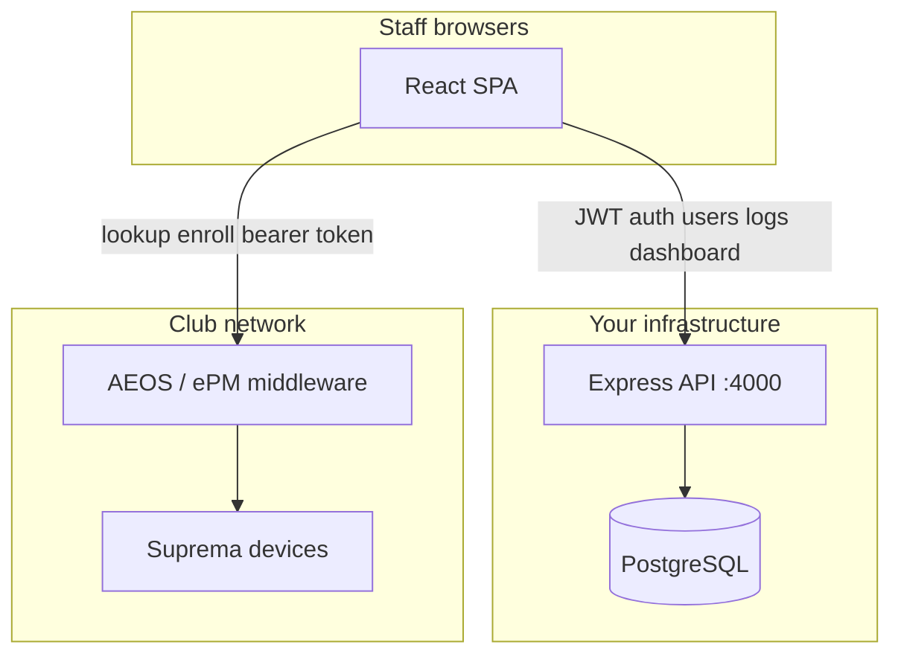

# KODE Face-ID — Portal Architecture & Design

This document describes how the Face-ID portal is structured, how its two backends interact, and how the UI is designed. It is intended for developers onboarding to the project or preparing a deployment.

---

## 1. System context

KODE Face-ID sits between **club staff** and two separate systems:



| System | What it owns |
|--------|----------------|
| **Portal backend + DB** | Portal user accounts, roles, JWT sessions, audit logs, dashboard aggregates |
| **AEOS / ePM** | Member records, carrier IDs, face templates, Suprema enrollment |

**Hard rule:** the portal database never stores face images, biometric templates, or full member profiles. Audit logs may record a membership code and AEOS carrier ID for traceability — nothing more.

---

## 2. Authentication model (two tokens)

Sign-in involves **two independent credentials**, because portal access and AEOS access are separate concerns.

```
1. Staff enters portal username + password
        ↓
   portalApi.login()  →  POST /api/auth/login  →  JWT stored in localStorage

2. App silently exchanges static API credentials
        ↓
   loginToApi()  →  POST {AEOS}/api/Login  →  Bearer token held in React state
```

- **Portal JWT** — identifies the staff member, drives RBAC, persists across page reloads.
- **AEOS Bearer token** — authorizes lookup and enrollment calls; refreshed every 12 minutes; lost on tab close.

If AEOS is unreachable (e.g. off VPN), portal login still succeeds. Enrollment actions fail until the middleware is reachable.

---

## 3. Backend architecture

The portal API follows a strict layered pattern. Each layer has a single responsibility; dependencies flow downward only.

```
HTTP Request
    │
    ▼
routes/          URL mapping, HTTP verbs
    │
    ▼
middleware/      auth · rbac · requestMeta · requestLogger
    │
    ▼
controllers/     Parse request, call service, shape JSON response
    │
    ▼
services/        Business rules, validation, orchestration
    │
    ▼
repositories/    Parameterized SQL via pg pool
    │
    ▼
PostgreSQL
```

### API surface

| Prefix | Purpose |
|--------|---------|
| `GET /api/health` | Liveness check |
| `POST /api/auth/login` | Portal sign-in |
| `GET /api/auth/me` | Current user + permissions |
| `/api/users` | User CRUD *(admin)* |
| `/api/logs` | Audit log write + query |
| `/api/dashboard/*` | Summary, timeseries, breakdown *(admin)* |

### Role-based access control

Two fixed roles with baked-in permission sets (`backend/src/config/permissions.js`):

- **admin** — full access including dashboard, user management, all logs
- **cx_agent** — enrollment + own activity logs only

Permissions are coarse capability strings (e.g. `members.enroll`, `dashboard.view`). Routes use `requirePermission` middleware; the frontend mirrors the same strings to show or hide navigation — **the backend always wins**.

### Database schema

**`users`** — portal accounts with bcrypt password hashes, role, active flag, timestamps.

**`audit_logs`** — append-only activity records:

| Column | Notes |
|--------|-------|
| `actor_id` / `actor_username` | Who performed the action |
| `action` | `login`, `lookup`, `upload`, `bulk_upload`, `user_create`, … |
| `status` | `ok`, `err`, `info` |
| `target_code` | Membership code (if applicable) |
| `carrier_id` | AEOS carrier ID (if applicable) |
| `ip_address`, `user_agent` | From `requestMeta` middleware |

### Observability

Structured **JSON logs** are written to stdout on every request:

```json
{
  "ts": "2026-06-17T12:00:00.000Z",
  "level": "info",
  "service": "kode-face-id-backend",
  "msg": "http_request",
  "requestId": "uuid",
  "method": "POST",
  "path": "/api/auth/login",
  "status": 200,
  "durationMs": 142.5,
  "ip": "::1"
}
```

Each response includes an **`X-Request-Id`** header for correlation with log aggregators (Datadog, Loki, CloudWatch, etc.). Configure verbosity with `LOG_LEVEL`.

---

## 4. Frontend architecture

All paths below are under `frontend/` in the repository.

### Module layout

| Area | Role |
|------|------|
| `src/App.jsx` | Root state machine: auth bootstrap, view routing, AEOS token lifecycle, audit callbacks |
| `src/services/api.js` | AEOS integration — `loginToApi`, `findOwner`, `addOwnerImage` *(intentionally unchanged integration contract)* |
| `src/services/portalApi.js` | Portal backend client — auth, users, logs, dashboard |
| `src/config/permissions.js` | Frontend RBAC mirror |
| `src/config/theme.js` | JS palette object referencing CSS variables |
| `src/theme/portalTheme.js` | Portal branding — logo path, glow RGB for login animation |
| `src/views/` | Full-page screens |
| `src/components/` | Reusable UI including hand-built SVG charts (no charting library) |

### View routing

Navigation is permission-gated inside `AppShell`:

| View | Permission | Audience |
|------|------------|----------|
| Dashboard | `dashboard.view` | Admin |
| Enrollment (Work) | `members.enroll` | Admin, CX Agent |
| Users & Roles | `users.manage` | Admin |

### AEOS enrollment flow

```
Enter membership code  →  findOwner()  →  display carrier ID + name
Select image (≤ 5 MB)  →  base64 encode  →  addOwnerImage()
        ↓
portalApi.recordLog()  →  audit entry in PostgreSQL (fire-and-forget)
```

Bulk enrollment loops the same pipeline with cancel support and per-row status.

### Dev proxy

In development, `vite.config.js` proxies `/api/*` to the internal AEOS host. Portal calls bypass this by using the full `VITE_PORTAL_API` URL (`localhost:4000`).

---

## 5. UI & design system

### Dual theme

Themes are implemented with **CSS custom properties** on `<html data-theme="light|dark">`. No runtime color recalculation in JavaScript — components read `var(--primary)`, `var(--surface)`, etc., so the entire UI re-themes instantly.

Key token groups in `frontend/src/styles/global.css`:

- **Surfaces** — `--bg`, `--surface`, `--surface-2`, `--border`
- **Typography** — `--text`, `--text-muted`, `--text-dim`
- **Brand** — `--primary`, `--primary-strong`, `--accent`, `--accent-2`
- **Semantic** — `--ok`, `--err`, `--warn` (+ soft/border variants)
- **Effects** — `--shadow-*`, `--ring`, `--login-glow-rgb`

`ThemeToggle` flips `data-theme` and persists preference to `localStorage`.

### App shell

Post-login layout uses a collapsible **sidebar** (`AppShell`):

- Logo + portal name in header
- Permission-filtered nav items with icons
- User chip (name, role) + sign out
- Main content area with toast notifications and loading overlay

### Login experience (KODE pattern)

The login screen follows the shared KODE portal pattern:

1. **Splash stage** — full-screen dark/light background, pulsing logo with cyan glow blob, *"Click to continue"*
2. **Click** — splash dismisses
3. **Form entrance** — card fades in and slides up (700 ms ease-out); username field receives focus

Brand color for Face-ID is **sky cyan** (`#38BDF8` dark / `#0EA5E9` light), applied to the glow, drop-shadow, buttons, and focus rings. Centralized in `theme/portalTheme.js` and `--login-glow-rgb`.

If `public/logo.png` is missing, a gradient **"K"** fallback (`.kode-logo`) is shown.

### Dashboard charts

Charts are **hand-rolled SVG** components (`components/Charts.jsx`) — line, bar, and donut — to avoid adding dependencies. They consume dashboard API aggregates and respect theme tokens for stroke/fill colors.

### Typography

**DM Sans** (UI) and **JetBrains Mono** (codes, timestamps) are injected at runtime via `utils/fonts.js`.

---

## 6. Error handling

| Layer | Behaviour |
|-------|-----------|
| AEOS `api.js` | `SessionExpiredError` on HTTP 401 → force logout + toast |
| Portal `portalApi.js` | `PortalAuthError` on HTTP 401 → redirect to login |
| Backend | Typed `AppError` hierarchy → consistent `{ error: { code, message } }` JSON |
| Audit logging | Always fire-and-forget; never blocks enrollment on failure |

---

## 7. Deployment considerations

| Concern | Recommendation |
|---------|----------------|
| Frontend | Build with `npm run build`; serve `dist/` statically. `web.config` included for IIS URL rewrite to AEOS. |
| Backend | Run with `NODE_ENV=production`; place behind reverse proxy with TLS. |
| Database | Run `npm run migrate` on deploy; never commit `.env`. |
| Secrets | Generate a strong `JWT_SECRET`; rotate seed passwords; consider moving AEOS credentials server-side. |
| CORS | Set `CORS_ORIGINS` to the exact production frontend origin. |
| Monitoring | Ship stdout JSON logs to your aggregator; alert on `level:error` and high `durationMs`. |
| AEOS access | Production frontend must reach the ePM middleware (VPN, internal DNS, or proxy). |

---

## 8. Testing

Backend unit tests (`backend/tests/`) cover:

- RBAC permission matrix
- Password hashing round-trip
- JWT sign/verify and tamper rejection
- Input validation helpers
- Typed error HTTP mapping

Run with `npm test` from `backend/`.

---

## 9. Extension points

| Goal | Approach |
|------|----------|
| Hide AEOS credentials | Add proxy routes in Express; point `api.js` at `/portal/aeos/*` |
| New role | Extend `permissions.js` (backend + frontend), seed migration, update Admin UI |
| New audit action | Add to `logService` allowed actions + frontend `ACTION_CODE` map |
| New portal theme color | Update `--primary` tokens and `portalTheme.js` glow RGB |
| Docker deployment | Compose Postgres + backend + static frontend *(not yet in repo)* |

---

## 10. Glossary

| Term | Meaning |
|------|---------|
| **AEOS** | Access control / member management system |
| **ePM** | Middleware API layer in front of AEOS |
| **Carrier ID** | AEOS identifier for a member record |
| **Portal** | This Face-ID web application and its Express backend |
| **CX Agent** | Customer-experience staff role with enrollment access |
| **Audit log** | Immutable record of a portal action (not AEOS system logs) |

---

*KODE Sports Club · Technology Department*
